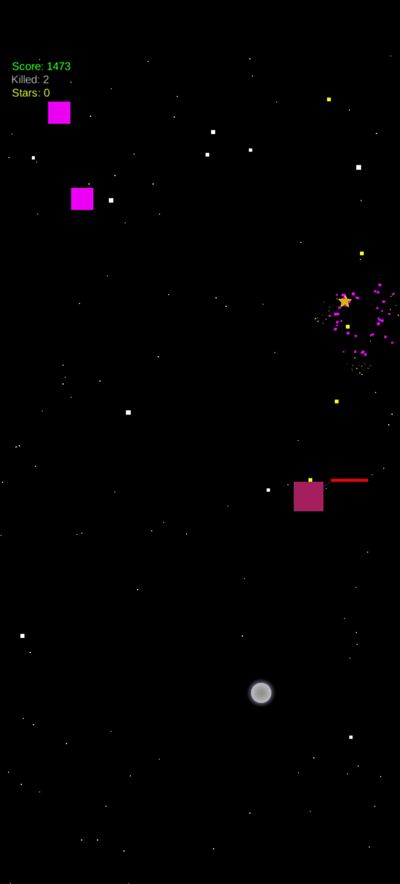
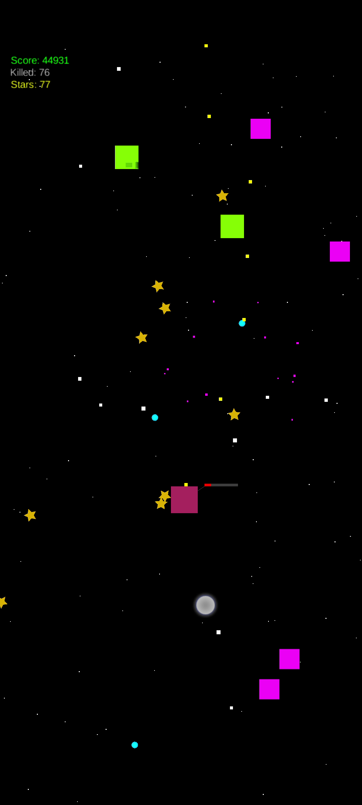
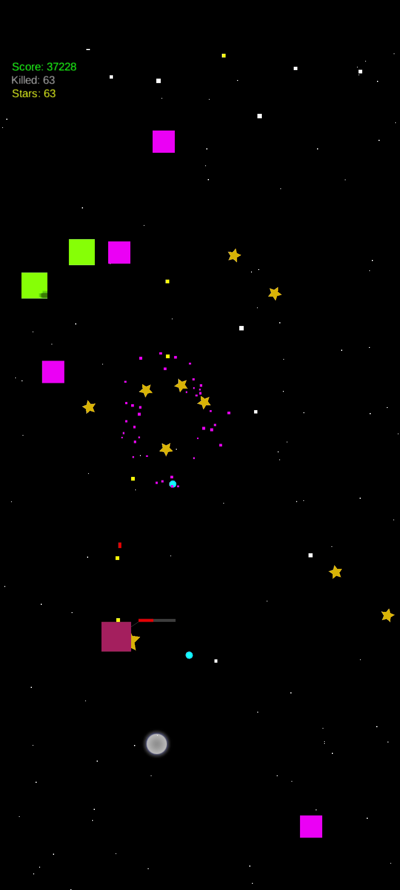
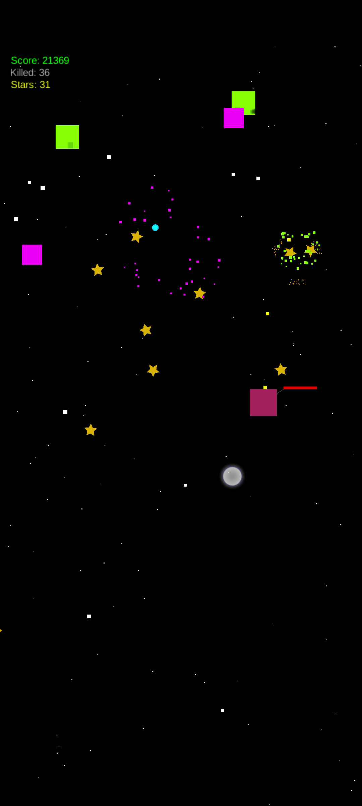
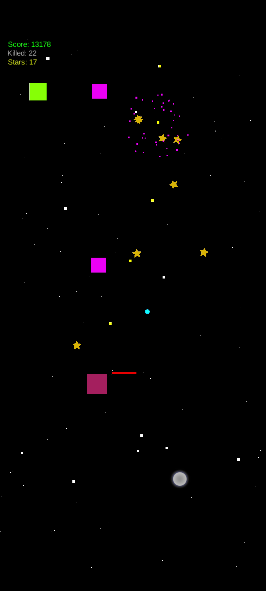
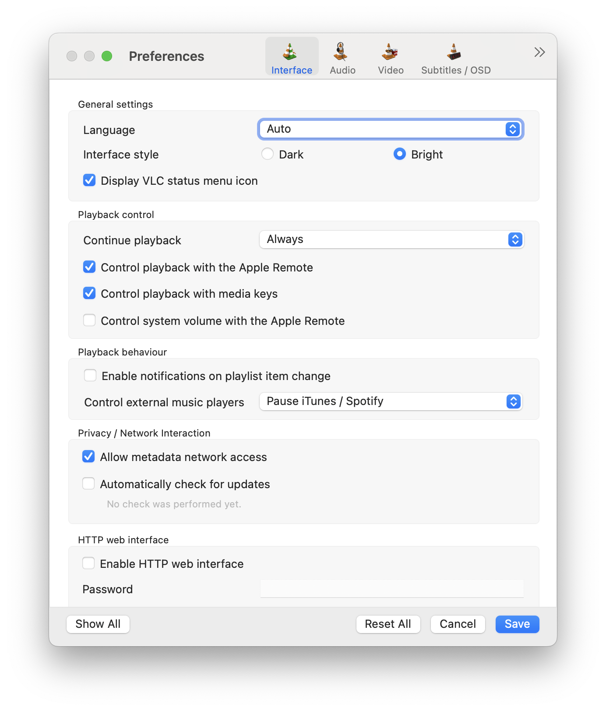
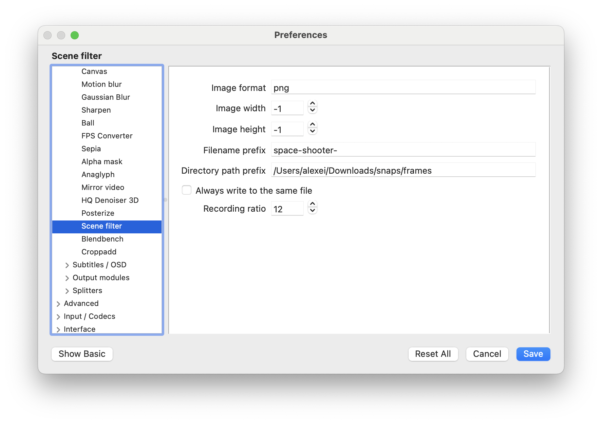
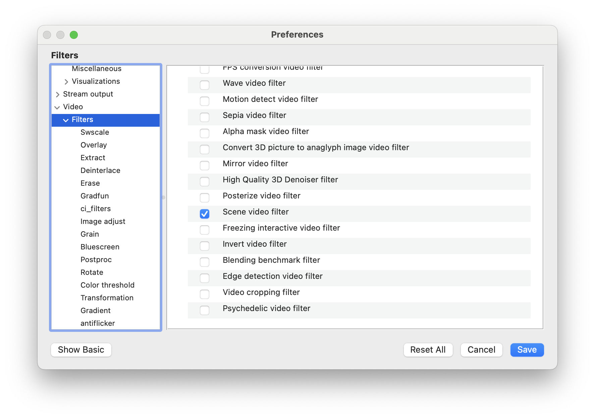

# Space Shooter

 A vertical scrolling space shooter game for `Android` and `iOS` inspired by [Sky Force](https://play.google.com/store/apps/details?id=pl.idreams.skyforcehd&hl=en&gl=US) written using [LibGDX](https://libgdx.com/).

 LibGDX is a cross-platform Java game development framework based on OpenGL (ES) that works on Windows, Linux, macOS, Android, iOS, and the browser.
 
## Install Android app

- [download and instal the Android apk](space-shooter-debug.apk)
or
- clone the repo and build from source

## Install iOS app

- clone the repo and build from source

> There's a bug which is preventing the iOS version from running on the simulator for some XCode versions

## Desktop and Web app

- Although libGDX supports compilation into desktop and web app, the Space Shooter project explicitly disables this functionality and targets the mobile platforms exclusively

## Requirements

- XCode - for building and running the iOS app

- Android Studio - for building and running the Android app

- [MobiVM plugin](https://plugins.jetbrains.com/plugin/14440-mobivm) for Android Studio - an ahead-of-time compiler for Java bytecode, targeting Linux, Mac OS X and iOS.


# Game Features

- Control the space ship by dragging your finger on the screen
- 2 Weapons
  - laser
    - fires often
  - rocket launcher 
    - fires homing rockets
    - the rocket pursues moving targets
- 2 enemy types
  - Pink 
    - 1 hit to kill
    - doesn't shoot
    - drops 1 star when killed
  - Green 
    - 5 hits to kill
    - aims at you and shoots a simple energy ball 
    - drops 3 stars when killed
- Stars are magnetically attracted to the ship when you are close enough 
- Slow-mo
  - Activated when you lift your finger off the screen


## TODO 

- Levels

- More enemy types

- More weapons types

- Bosses

- Upgrades

- Items which can be picked up

- Cool physics, explosions and texture graphics

## Soundtrack

- the soundtrack music is taken from  Unreal Tournament

## Screenshots

[](assets/screenshots/space-shooter.gif) [](assets/screenshots/space-shooter-01.png) [](assets/screenshots/space-shooter-02.png) [](assets/screenshots/space-shooter-03.png) [](assets/screenshots/space-shooter-04.png) [](assets/screenshots/space-shooter-05.png)


# How to record game play video and make into a gif

## Record Android screen using Screen Recorder (Android 11+)

- `Screen Record` function is available on Android 11+ by default. No need to install third party apps

- Swipe down from Android system tray and select `Screen Record`. If you don't see this option, `edit` your system tray to show it. You can `edit` by swiping down the system tray and clicking the `pencil` edit button

- Do not confuse `Screen Record` with `Recorder`. The later is a just voice recorder

- Configure screen recorder by optionally selecting to record `System Audio` and/or `Microphone`

- It's handy to also enable recording of `screen touches`

- To stop recording, swipe down from the system tray and click `Stop Recording`

- The video file will be saved to your internal storage after a short processing time

## Extract frames from video with VLC player 

- install [VLC](https://www.videolan.org/vlc/) player

- Open VLC settings, click `Show All` settings, open the `Scene filter` under `Video -> Filter`

- Configure the filter by entering the filename prefix to use for each image file that will be extracted, and the directory to save them to

- Set `Recording ratio` - how often to extract a frame. For example, a setting of `12` will extract every `12th` frame. The lower the setting the more images will be created in the output folder

- Go to `Video -> Filters` and check the `Scene filter` checkbox to actually enable the filter after configuring it

- Click `Save`

- Might need to close VLC and reopen it

- With `Scene filter` setting enabled, VLC will extract frames from every video _while it's playing_.

> Remember, frames are extracted `only while the video is playing`. You can stop and seek the video to any position and play it to begin extraction. Stop playing to stop extraction.

- To stop VLC from extracting frames in the future, disable the filter by unchecking the `Scene filter` checkbox in settings

[](assets/vlc/vlc-settings.png)
[](assets/vlc/vlc-scene-filter-settings-1.png) 
[](assets/vlc/vlc-scene-filter-settings-2.png) 


## Make a GIF from a set of images using ffmpeg

- install [ffmpeg](https://www.ffmpeg.org/). Can use `homebrew`.

- The command below will make all `png` files inside the script folder into a gif called `output.gif`

- The filename pattern is specified with, `-pattern_type glob -i '*.png'`

- Framerate is set to 12 frames per second with, `-framerate 12`, default framerate is `25`.

- The images will be scaled to `640 pixels wide` while maintaining aspect ratio, `-2` syntax means `"maintain aspect ratio"`

```
ffmpeg -framerate 12 -pattern_type glob -i '*.png' -filter_complex "[0:v]scale=640:-2,split[x][z];[x]palettegen[y];[z][y]paletteuse" output.gif
```